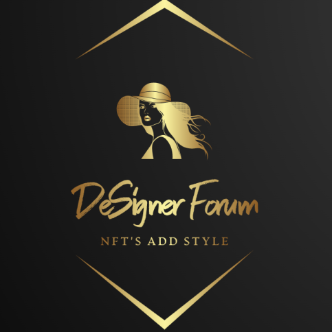

# DeSigner Forum

## Overview

DeSigner Forum is a decentralized social media that can be used by fashion designers to post their exclusive designs and create NFTs. They can put up their NFTs for sale on the DeSo Blockchain. Fashion enthusiasts can visit the platform and view the NFTs of popular designers. They can choose to purchase or bid for NFTs. They can also provide tips to the designer in the form of diamonds, which can be later redeemed for DeSo tokens. This will help designers have additional revenue streams and enable them to provide exclusive content for their admirers. Fashion enthusiasts can also follow and create posts on the decentralized social media powered by DeSo. Using the platform as a lookbook helps designers to gain wider outreach and aids fashion brands in marketing.

We desired to build a dedicated platform for fashion designers and digital fashion. This would enable them to host their exclusive designs and reach out to fashion enthusiasts. The platform is intended to be decentralized so that it is not owned or controlled by any single entity or company. Also there are no intermediaries and thereby no loss in revenue as commission to third parties.We incorporated NFTs into the platform as a means for designers and brands to tokenize their digital work. NFTs or Non-Fungible Tokens represent a unique digital asset, which can be incorporated by brands and designers into their marketing strategy.
